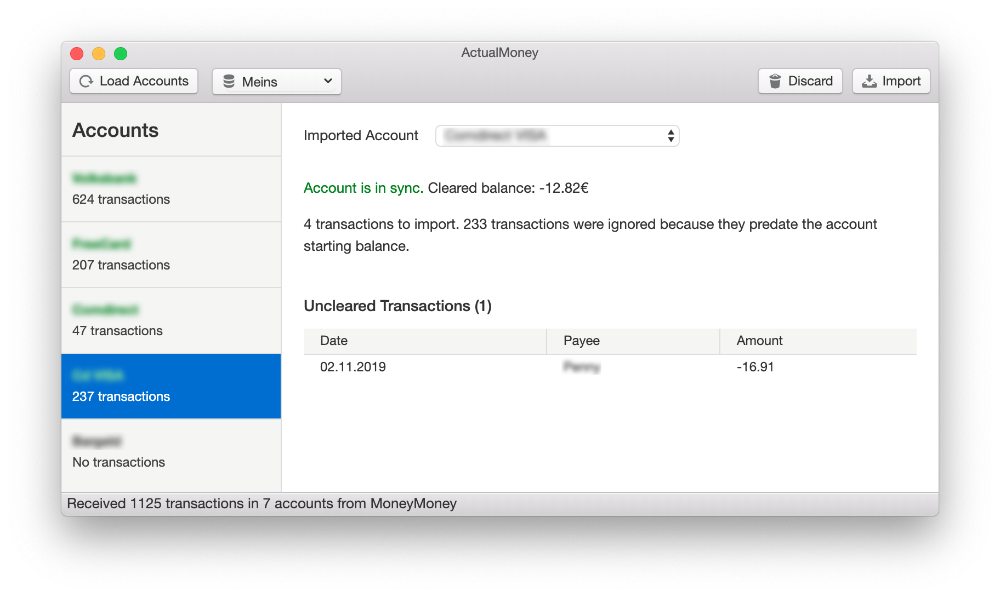

  

ActualMoney is a macOS application that synchronises bank statements from [MoneyMoney.app](https://moneymoney-app.com/), a popular german banking software, to [Actual.app](https://actualbudget.com/), a zero-based budgeting software.

Installation
------------
1. Download latest release form [GitHub releases](https://github.com/heilerich/actualmoney/releases)
2. Extract ZIP and drop application into `/Applications`

Usage
-----
1. Start *ActualMoney* and allow it to install it's *MoneyMoney* extension
2. Use the new `Send to ActualMoney` context menu entry in *MoneyMoney*
3. Match your *Actual* accounts to the corresponding bank accounts in *MoneyMoney*
4. Click `Import` in *ActualMoney* and review the result.
5. If your accounts are not in sync after importing, review your starting balance and date in *Actual* and make sure it matches the closing balance on that day in *MoneyMoney*.
